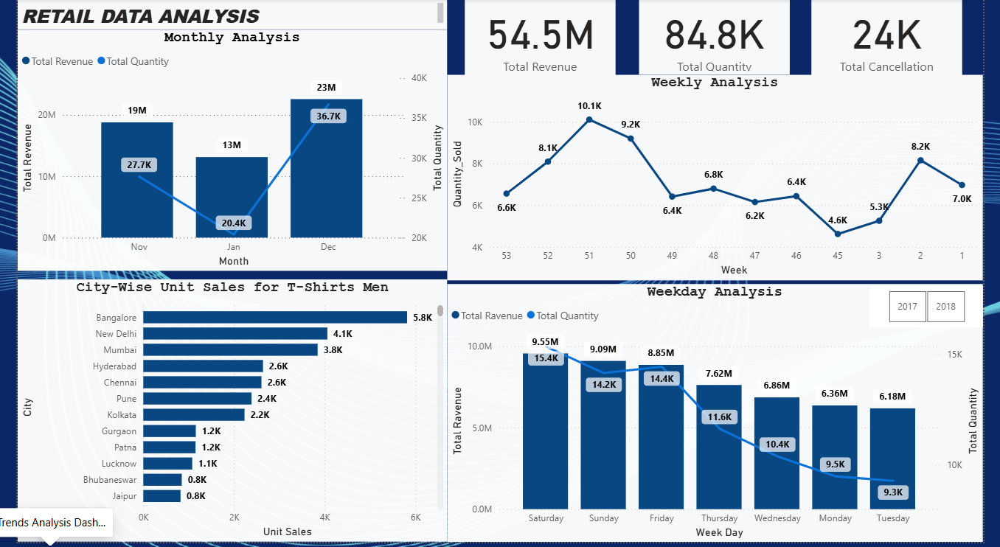
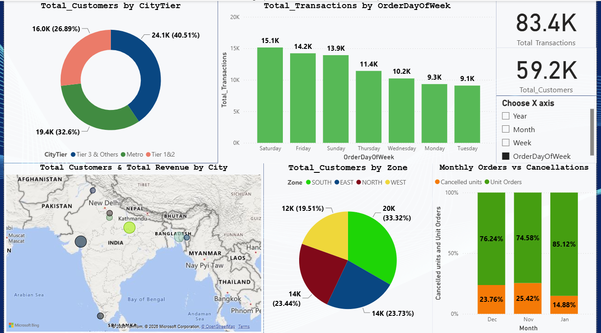

# Retail Sales Analytics - Power BI

A retail sales analytics dashboard developed in **Microsoft Power BI** using data modelling, table relationships, DAX calculations, data preparation, and interactive visualizations to analyze sales performance, revenue trends, product and category performance, customer distribution, and geographic insights.

---

## Project Overview

This project focuses on analyzing retail sales data from multiple source files and transforming it into an interactive Power BI dashboard.

The dataset contains information related to:

* Sales transactions
* Customers
* Products
* Product groups
* Cities
* Geographic zones
* City tiers
* Orders and cancellations

The project demonstrates an end-to-end Power BI analytics workflow, starting from raw data loading and preparation through data modelling, DAX calculations, relationship management, visualization, and business insights.

---

## Business Problem

The retail business maintains data across multiple independent files. Analysing these datasets separately makes it difficult to obtain a consolidated view of sales performance and customer behaviour.

The objective is to build a centralized analytical dashboard that helps answer questions such as:

* How much revenue is being generated?
* How many units are being sold?
* How many units are cancelled?
* How are sales changing over time?
* Which product groups perform better?
* Which cities and zones contribute the most customers?
* How does customer distribution vary across city tiers?
* Which days of the week generate higher revenue and transactions?
* Where are sales or customer opportunities concentrated?
* How do orders and cancellations vary across different periods?

---

## Project Objectives

The major objectives of this project are:

1. Load and combine data from multiple source files into Power BI.
2. Clean and prepare the datasets for analysis.
3. Establish appropriate relationships between tables.
4. Create calculated fields using DAX.
5. Analyse revenue, quantity, cancellations, customers, and transactions.
6. Analyse sales performance by time period.
7. Analyse product and product-group performance.
8. Analyse customer distribution across cities, zones, and city tiers.
9. Identify important sales and customer trends.
10. Develop an interactive Power BI dashboard.
11. Generate actionable business recommendations from the analysis.

---

## Dataset

The project uses four primary data sources:

### 1. Sales Data

Contains retail sales transaction-level information used to analyse:

* Revenue
* Units
* Cancelled units
* Orders
* Customers
* Dates
* Product groups
* Cities

### 2. Product Mapping Data

Contains product-related information used to map products into appropriate product groups and categories.

### 3. City Tier Data

Contains city-level information and corresponding city tiers.

### 4. Pin Code Geographic Data

Contains geographic information used to associate cities with different zones.

---

## Data Preparation

The raw datasets were prepared before building the final Power BI model.

The major data preparation steps included:

* Loading all source files into Power BI.
* Ensuring that appropriate headers were used.
* Removing records where `Zone` was missing from the `PinCode-Geo` dataset.
* Removing records where `CityTier` was missing from the City Tier dataset.
* Checking common columns across datasets.
* Creating appropriate relationships between tables.
* Renaming the original `City` field to `City_Old`.
* Creating a cleaned `City` field containing only the city name.
* Preparing date-related fields for time-based analysis.
* Creating weekday information from the order date.
* Creating a week-start date where the week begins on Monday.
* Updating table relationships after the transformations.

---

## Data Model

The project uses Power BI's relational data modelling capabilities to connect the different datasets through common fields.

The relationships allow the dashboard to analyse sales data across multiple dimensions, including:

* Customer
* Product
* Product Group
* City
* City Tier
* Zone
* Date

The model enables interactive filtering and cross-analysis between different business dimensions.

---

## DAX Calculations

DAX was used to create calculated fields required for the analysis.

### Net Units

Net units were calculated by subtracting cancelled units from total units.

```DAX
Net_Units = Units - Cancelled_Units
```

This measure helps provide a more meaningful view of actual units retained after cancellations.

---

### Order Day of Week

A weekday field was created from the order date to analyse sales performance across:

* Monday
* Tuesday
* Wednesday
* Thursday
* Friday
* Saturday
* Sunday

---

### Order Week Start

A week-start field was created so that weekly analysis follows a Monday-to-Sunday structure.

The resulting field allows weekly sales and quantity trends to be analysed consistently.

---

## Dashboard

The Power BI dashboard provides an interactive view of retail sales performance across multiple dimensions.

The analysis includes:

### Sales Performance

* Total revenue
* Total quantity
* Net units
* Cancelled units
* Transactions
* Customer distribution

### Time Analysis

* Monthly revenue
* Monthly quantity
* Weekly quantity
* Weekday revenue
* Weekday quantity
* Transactions by weekday
* Orders and cancellations over time

### Product Analysis

* Product group performance
* Revenue contribution
* Quantity contribution
* Product-level analysis

### Customer Analysis

* Customer distribution
* Customer distribution by city
* Customer distribution by city tier
* Customer distribution by geographic zone

### Geographic Analysis

* Zone-wise customer distribution
* City-level performance
* City-tier analysis
* Regional sales patterns

---

## Dashboard Screenshots

### Dashboard Snapshot 1



### Dashboard Snapshot 2



---

## Key Insights

### 1. Revenue by Weekday

* **Saturday** generated the highest revenue.
* **Tuesday** recorded the lowest revenue.
* Overall revenue showed a declining trend from **2017 to 2018**.
* Weekend revenue was generally stronger than weekday revenue.
* The highest quantity day was **Wednesday**, while Tuesday recorded the lowest quantity.

An important observation is that the weekday with the highest quantity does not necessarily generate the highest revenue, indicating differences in product mix and average order value.

### Business Recommendation

* Introduce targeted promotions on Tuesdays.
* Consider mid-week sales and loyalty campaigns.
* Maximize weekend demand through targeted offers and marketing campaigns.
* Analyse product mix and order value differences between weekdays and weekends.

---

### 2. Monthly Sales Performance

The monthly analysis showed notable variation in revenue and quantity.

| Month    | Revenue | Quantity |
| -------- | ------: | -------: |
| October  |    ~19M |   ~27.7K |
| November |    ~13M |   ~20.4K |
| December |    ~23M |   ~36.7K |

December recorded the highest revenue and quantity among the analysed months, while November showed a noticeable decline.

### Business Recommendation

* Investigate the reasons behind the November decline.
* Identify the factors contributing to December's strong performance.
* Prepare inventory and marketing strategies ahead of seasonal demand.
* Use targeted campaigns during historically weaker periods.

---

### 3. Weekly Quantity Trend

Week 54 recorded the highest quantity at approximately **10.1K units**.

Quantity then declined during Weeks 56-58 before recovering in:

* Week 59: approximately **9.2K**
* Week 60: approximately **10.1K**

### Business Recommendation

* Investigate the causes behind weekly peaks and dips.
* Identify operational or promotional factors affecting weekly demand.
* Use targeted promotions during declining periods.
* Monitor cancellation patterns alongside weekly sales.
* Collect customer feedback to understand demand fluctuations.

---

### 4. Customer Distribution by City Tier

Customer distribution varied across different city categories.

* **Tier 3 & Other Cities:** ~24.1K customers
* **Metro Cities:** ~19.4K customers
* **Tier 1 & 2 Cities:** ~16K customers

Tier 3 and other cities represented the largest customer base among the analysed categories.

### Business Recommendation

* Focus on high-potential markets with larger customer populations.
* Develop targeted campaigns for different city tiers.
* Identify opportunities for market expansion in underpenetrated locations.
* Adjust regional marketing strategies according to customer concentration.

---

### 5. Transactions by Weekday

Saturday and Friday recorded the highest number of transactions.

* **Saturday:** ~14.2K transactions
* **Friday:** ~13.9K transactions
* **Monday:** ~9.1K transactions
* **Tuesday:** ~9.1K transactions

The analysis indicates stronger customer transaction activity toward the end of the week.

### Business Recommendation

* Introduce Monday and Tuesday promotional campaigns.
* Use Friday and Saturday specials to maximize already strong demand.
* Analyse customer shopping behaviour across different weekdays.
* Investigate the relationship between shopping activity and factors such as weekend behaviour or payday cycles.

---

### 6. Customer Distribution by Zone

The customer distribution across geographic zones was:

| Zone  | Customer Share |
| ----- | -------------: |
| West  |         33.32% |
| North |         23.73% |
| East  |         23.44% |
| South |         19.51% |

The **West zone** represented the largest share of customers, while the **South zone** represented the smallest share.

### Business Recommendation

* Leverage the strong customer base in the West zone.
* Identify market penetration opportunities in the South.
* Develop localized campaigns based on regional customer behaviour.
* Use regional feedback to improve market-specific strategies.

---

### 7. Orders vs Cancellations

The analysis showed variations in the proportion of ordered and cancelled units across months.

| Month    | Orders | Cancellations |
| -------- | -----: | ------------: |
| January  | 85.12% |        14.88% |
| December | 76.24% |        23.76% |
| November | 74.58% |        25.42% |

November recorded the highest cancellation proportion among the analysed months.

### Business Recommendation

Potential cancellation drivers should be investigated, including:

* Product quality
* Delivery experience
* Customer service
* Inventory availability
* Order fulfilment issues

Customer feedback and cancellation reason analysis can help identify opportunities to improve order completion rates.

---

## Business Recommendations Summary

Based on the analysis, the following actions can be considered:

### Sales

* Focus promotional campaigns on low-performing weekdays.
* Maximize weekend demand through targeted offers.
* Monitor declining revenue trends across years.

### Customer

* Focus on high-potential city tiers and regions.
* Develop localized marketing campaigns.
* Identify opportunities in regions with lower customer penetration.

### Operations

* Investigate high cancellation periods.
* Analyse cancellation reasons.
* Improve order fulfilment and customer experience.

### Marketing

* Use weekday-specific campaigns.
* Prepare seasonal campaigns based on historical trends.
* Target customers based on geography and purchasing behaviour.

### Inventory

* Prepare inventory for periods with historically higher demand.
* Monitor weekly demand fluctuations.
* Align inventory planning with seasonal sales patterns.

---

## Tools & Technologies

* **Microsoft Power BI**
* **Power Query**
* **DAX**
* **Data Modelling**
* **Data Cleaning**
* **Data Transformation**
* **Data Visualization**
* **Business Intelligence**
* **Exploratory Data Analysis**

---

## Power BI Skills Demonstrated

This project demonstrates practical application of:

* Data loading
* Power Query transformations
* Data cleaning
* Data modelling
* Table relationships
* Calculated columns
* DAX calculations
* Interactive visualizations
* KPI analysis
* Slicers and filters
* Business-oriented dashboard design
* Insight generation
* Recommendation building

---

## Project Workflow

```text
Raw Data Files
      ↓
Data Loading
      ↓
Data Cleaning & Transformation
      ↓
Data Modelling
      ↓
Table Relationships
      ↓
DAX Calculations
      ↓
Exploratory Analysis
      ↓
Dashboard Development
      ↓
Business Insights
      ↓
Recommendations
```

---

## Project Structure

```text
Retail-Sales-Analytics-PowerBI/
│
├── Assets/
│   ├── ss1.png
│   └── ss2.png
│
├── Business Problem/
│   └── Power BI Retail case study.pdf
│
├── Dashboard/
│   └── Retail Case Study Power Bi.pbix
│
├── Data/
│   ├── Mod3_Raw_CityTier_v0.1.csv
│   ├── Mod3_Raw_PinCodeGeo_v0.1.xlsx
│   ├── Mod3_Raw_ProductMap_v0.1.csv
│   └── Mod3_Raw_Sales_v0.1.xlsx
│
└── README.md
```

---

## Key Takeaways

This project provided practical experience in building a Power BI analytics solution from multiple raw datasets.

Key learning areas included:

* Preparing and transforming raw business data.
* Creating relationships between multiple tables.
* Building a structured Power BI data model.
* Writing DAX calculations.
* Performing time-based sales analysis.
* Analysing customers across geographic dimensions.
* Identifying sales and cancellation patterns.
* Designing interactive dashboards.
* Converting analytical findings into business recommendations.

---

## Project Context

This project was developed as part of a **Power BI / Data Visualization case study** during Data Analytics training.

The objective was to demonstrate practical application of Power BI concepts including data preparation, modelling, DAX, visualization, and business analysis.

---

## Author

**Vikas Nagar**

**Associate Data Scientist | Data Analytics | Machine Learning**

* LinkedIn: [linkedin.com/in/vikas31](https://www.linkedin.com/in/vikas31)
* GitHub: [github.com/vikasnagar31](https://github.com/vikasnagar31)
* Portfolio: [portfolio-vikasnagar.vercel.app](https://portfolio-vikasnagar.vercel.app)

---
